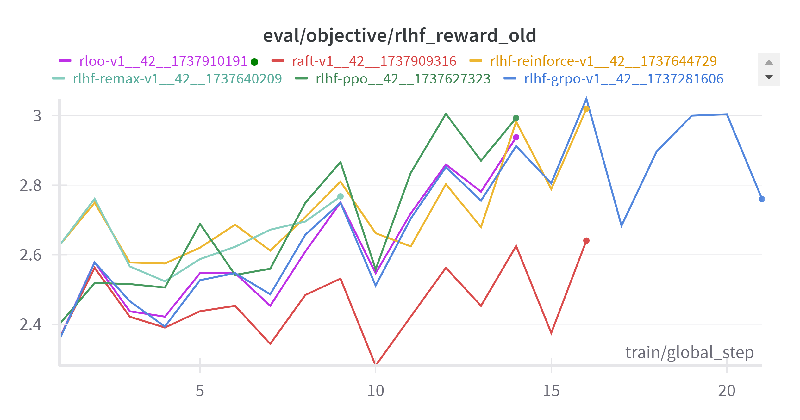

# nanoRLHF
RLHF experiments on a single A100 40G GPU. 
# Usage
Take GRPO for example, 
```bash
cd nanoRLHF/grpo
```
```
python grpo.py
```
# Default Setting
policy model : Qwen/Qwen2.5-1.5B-Instruct

reward model/function : OpenAssistant/reward-model-deberta-v3-large-v2

...

ALL setting is on the file you run.
# Performance
The training throughput is approximately 1s /episode with the default settings. Reward results are as follows:

# Acknowledgement
The code is adapted from trl, but way more **efficient**, more **flexible** reward function, specially designed for researchers that want to try small RLHF experiments quick on a single GPU.
