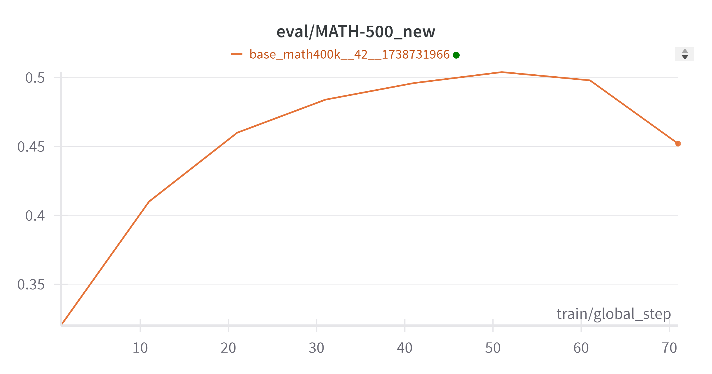
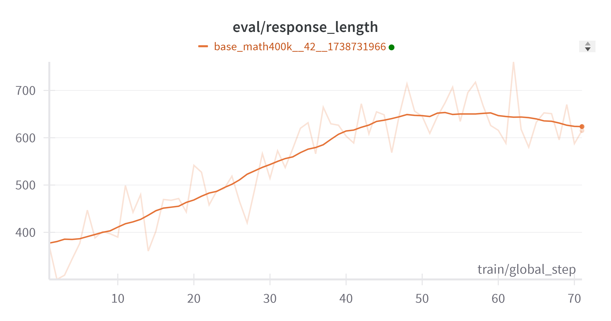
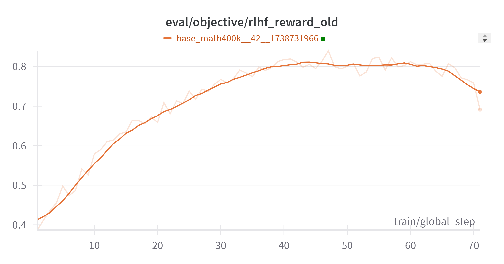

# deepSeek R1-Zero reproduing attempts:

In this folder, we try to repoduce **the figures of test time scaling during training** of r1 zero in [their paper](https://arxiv.org/abs/2501.12948) (that is, their figure 2 and figure 3) on a small model. The a-ha moment of self-check doesn't matter at this point for two reasons:
1. Self-checks or self relections always exist in base model, without any finetuning or post training. This can be easily verified by sampling enough times and searching words like 'mistake', 'However' in model's responses. [As we previously observed from QWEN2.5 math](https://zhuanlan.zhihu.com/p/3477379830), about 0.5% percent of responses have self-reflections.
2. However, large scale ubiquitous self-relections like o1 and r1 have not been observed in my post-training for small models.  

We use [Qwen-2.5-1.5B](https://huggingface.co/Qwen/Qwen2.5-1.5B) as the base model, and use [meta-math/MetaMathQA](https://huggingface.co/datasets/meta-math/MetaMathQA) as train dataset. Then we use GRPO (actually a sparse version of it, as will be explained below) to train the base model, the reward is 1 if the model gets the correct answer, and 0 otherwise. Our results are as follows:

**Accuracy on [MATH-500](https://huggingface.co/datasets/HuggingFaceH4/MATH-500) (it didn't improve a lot on AIME as the original paper):**

**Response length (tokens):**

**Reward:**


# Usage
This code runs on a single A100 40G. To reproduce, run
```bash
cd nanoRLHF/examples/r1-v0
```
```python
python grpo_r1.py
```
# Features
1. Sparse GRPO：We abandon the samples whose advantages are 0. That saved us a lot of time without losing much performance.
2. To save more time, we implement dynamic batching for the sample generating and the minibatch forwarding and backwarding.
  
These features enable efficient training of Qwen-1.5B with a response length of 8000 tokens.

# To do
 We have been trying to reproduce large scale ubiquitous self-relections in small models. This one experiment is just a small piece of effort for show.
## Citation

If this work is helpful, please kindly cite as:

```bibtex
@article{r1v0,
  title={r1v0: deepSeek R1-Zero reproduing attempts}, 
  author={Yannan Luo},
  year={2025},
  url={https://github.com/jackfsuia/nanoRLHF/edit/main/examples/r1-v0}
}
```
